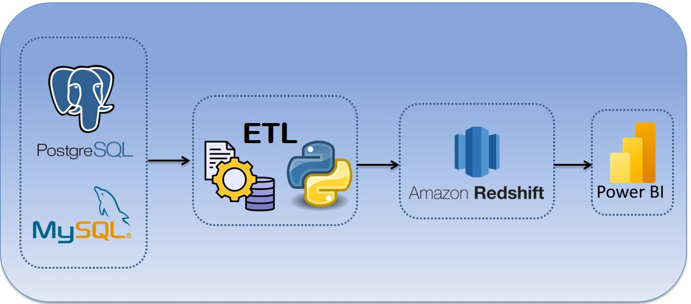

## OVERVIEW

## Laskavo proshu 

Here described information how to run this on local environment.

- Required software:
    - PostgreSQL (or another convenient database);
    - VS Code;
    - Having access to AWS Redshift/Bigquery/Snowflake data warehouses, use either of them. I created a PostgreSQL database, because it`s an open-source database, and AWS Redshift is a Postgres-based data warehouse;
    - PowerBI.

- Run configuration:
  - Go to **CreateDBsInPostgre** folder and execute SQL code to create databases and tables in PostgreSQL;
  - (optionally) Go to **CreateFakeSQL** and run `.py` scripts (it will create fake SQL-inserts);
  - Go to **InsertFakeSQL** and copy `.sql` scripts into PostgreSQL Query tool (it is to insert data into your newly created tables);
  - Go to **scripts** and run `WHENpostgreETL.py` or 'WHENmysqlETL.py', depending on your chosen database (merges all tables, and loads to the "improvised" data warehouse);
  - Go to **PBI** and open dashboards in PowerBI. There are several dashboards (switch pages through UI).

You can change a column order in the dwh, or do other improvements, if there`s a need.

Finish =) 

Keep learning and growing!
